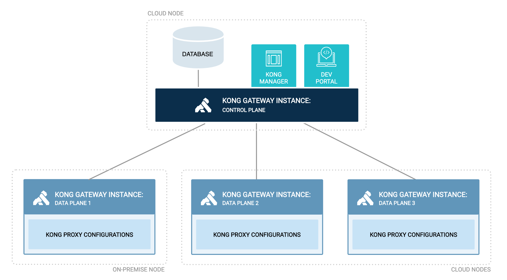
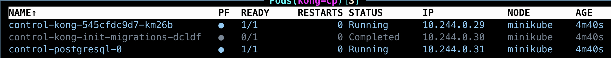
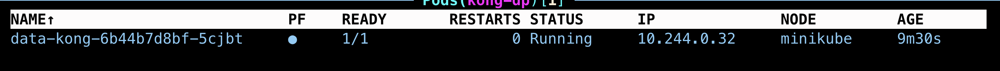
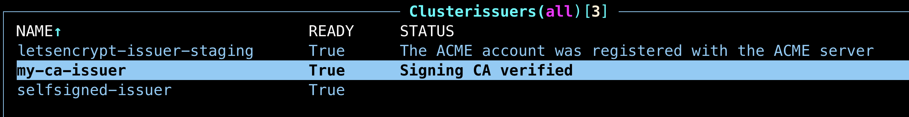

# Kong Deployment - Hybrid Mode

This repo contains code and configuration for deploying Kong API Gateway in Hybrid Mode with DB

## Pre-requisites

1. [minikube](https://minikube.sigs.k8s.io/docs/start/) or any k8s cluster
2. [helm](https://helm.sh/docs/helm/helm_install/)
3. [kubectl](https://kubernetes.io/docs/tasks/tools/)
4. [k9s](https://k9scli.io/topics/install/) (optional)
5. [konnect account](https://konghq.com/products/kong-konnect) (optional)

## Kong Hybrid Deployment

Source: Kong Docs

Kong nodes in a hybrid deployment cluster are split into two roles: control plane (CP), where configuration is managed and the Admin API is served from; and data plane (DP), which serves traffic for the proxy. Each DP node is connected to one of the CP nodes, and only the CP nodes are directly connected to a database. [Read more](https://docs.konghq.com/gateway/latest/production/deployment-topologies/hybrid-mode/)

 

## Hybrid - Shared Cert (Non-Production)

Start your minikube or k8s cluster and make sure you can run commands and verify connection to cluster

`kubectl get pods -A`

Create two namespaces so that you can have all kong related objects grouped as cp and dp

`kubectl create namespace kong-cp`
`kubectl create namespace kong-dp`

In this option we create a shared-cert which will be used by both Control Plane and Data Plane to authenticate each other via mTLS. 

```
openssl req -new -x509 -nodes -newkey ec:<(openssl ecparam -name secp384r1) \
    -keyout ./kong-cluster.key -out ./kong-cluster.crt \
    -days 1095 -subj "/CN=kong_clustering"
```
* Note: If you change the CN name, then it must be mentioned in a environment property on data plane yaml file `cluster_server_name`, default is kong_clustering

Create a secret from the cert files on the kong-cp and kong-dp namespace

`kubectl create secret tls kong-cluster-cert -n kong-cp --cert=kong-cluster.crt --key=kong-cluster.key`

`kubectl create secret tls kong-cluster-cert -n kong-dp --cert=kong-cluster.crt --key=kong-cluster.key`

Lets start installing kong components. Follow the steps below, 

Add the kong helm chart,

`helm repo add kong https://charts.konghq.com`

Charts come with default values based on the published ones. You can also configure/customize the values for charts using a values.yaml file. For this installation I am using a values file [hybrid-cp](./shared-cert/hybrid-cp.yml)

Install the chart with a release name `control` under a namespace `kong-cp` with customized values file. 

`helm install control kong/kong -n kong-cp -f hybrid-cp.yml`

You will see below pods have been created. The screenshot is from k9s which helps you to visualize the cluster and navigate quickly instead of running kubectl commands.



You can also check the status using, 

`kubectl get pods -n kong-cp`

In order to test the kong control plane is up and running you need to expose the port outside the cluster. I will be using port-forward. You can replace the pod name from the output of above command. 

`kubectl port-forward control-kong-564f4db746-4dvkk -n kong-cp 8001:8001`

`http://localhost:8001` Open this ina browser or through curl,

You can also port-forward the port 8002 to access the Kong Manager UI in free mode. 
`http://localhost:8002`

Similarly create the dataplane which can help in proxying the API traffic. In the values file [hybrid-dp](./shared-cert/hybrid-dp.yml) you can see except for proxy all other components are not enabled. 

`helm install data kong/kong -n kong-dp -f hybrid-dp.yml`



In order to test the kong gateway is up and running you need to expose the port outside the cluster. I will be using port-forward. You can replace the pod name from the output of above command. 

`kubectl port-forward data-kong-6b44b7d8bf-5cjbt -n kong 8000:8000`

Open a new shell prompt and run the curl command,

`curl -i http://localhost:8000`

## Hybrid - PKI Self Signed (Non-Production)

So far you have used a shared secret (tls certificate) to establish the mtls trust between Control Plane and Data Plane. This may not be ideal for your enterprise scenario. Public Key Infrastrcture (PKI) allows you to create certs which are specific to one plane. This reduces the risk of shared certificate compromise. 

This generation of certificate can be managed externally by you or else automate it using [cert-manager](https://cert-manager.io/docs/) in K8s. For installing the cert-manager in your cluster use the [certmanager.sh](./certmanager.sh)

For the cluster authentication between CP and DP to be successful, the certificate must be signed by same issuer. To do this, you need to create three objects,

* Self signed Certificate Authority that uses a self-signed issuer
* Self signed issuer
* Your own issuer based on root CA

Refer the [issuers.yml](./pki-self-signed/issuers.yml)

Create these k8s objects by running below command. Note you have used a ClusterIssuer which simplifies our objects to be available for the entire cluster. 

`kubectl apply -f issuers.yml`



You can test the sample certificate issuance to validate if the configurations are good. Use the [sample-cert](./sample-cert.yml). You should see the "Certificate is up to date and has not expired"

`kubectl apply -f sample-cert.yml`

To enable the cert-manager in the helm chart you need to add the below and the respective common name to be updated in the env property. 

```
certificates:
  enabled: true
  clusterIssuer: my-ca-issuer
  cluster:
    enabled: true
    commonName: cluster.example.com
```

Install the control plane and data plane components using helm chart values. There are additional cluster related env properties defined [here](./pki-self-signed)

`helm install control kong/kong -n kong-cp -f hybrid-cp.yml`

`helm install data kong/kong -n kong-dp -f hybrid-dp.yml`

## Hybrid - PKI CA Signed (Production)

Previously, you created the certificate using your signer which is good for your non-production use cases but when it comes to enterprise use cases, you need to have a Certificate Authority who issues certificates for you. This CA can be integrated into the cert-manager making the certificate management job seamless. 

To enable CA signed certificates in your cluster, you need to identify if your CA supports [integration](https://cert-manager.io/docs/configuration/external/#known-external-issuers) with the cert-manager.

For understanding, you are going to use LetsEncrypt which provides free TLS certificates. To explore this option, you need to have access to your domain. Since my domain is protected over Cloudfare, I will be showing how to issue certificates with the help of Cloudfare and ACME. The inner working of the cert-manager is out of the scope of this article. 

For K8s to request a certificate signed by LetsEncrypt, you need to create a ClusterIssuer that talks over ACME APIs to the domain, verifies if it is valid and then issues the certificate. For ACME to verify if you own the domain, you need to create an API token which is used to talk to Cloudflare APIs. 

Create the secret with the below yaml, replace the api-token with token generated from cloudflare

```
apiVersion: v1
kind: Secret
metadata:
  name: cloudflare-api-token-secret
  namespace: cert-manager
type: Opaque
stringData:
  api-token: *****
```

Create the ClusterIssuer so that both CP and DP use the same for generating  certificates,

`kubectl apply -f issuers.yml`

In the helm charts values you will use the issuer as the name that you have created

```
certificates:
  enabled: true
  clusterIssuer: letsencrypt-issuer-staging
  cluster:
    enabled: true
    commonName: cluster.example.com
```

Install the control plane and data plane components using helm chart values. There are additional cluster-related env properties defined [here](./pki-ca-signed/)

`helm install control kong/kong -n kong-cp -f hybrid-cp.yml`

`helm install data kong/kong -n kong-dp -f hybrid-dp.yml`

When you use LetsEncrypt, the certificate secret generated by cert-manager would not contain the ca.crt values, this is a known issue with LetsEncrypt, but this is a requirement for kong cluster mtls validation that we have to specify the ca.crt values in the env parameters. It may fail if you use ACME based issuer (still trying to figure out a way). But this is the approach to having a CA-signed certificate. 

## Switching to Enterprise

In order to use the enterprise capabilities of Kong like advanced plugins and others, you need to add the license as secret and add the secret name to values.yaml in the enterprise section,

`kubectl create secret generic kong-enterprise-license --from-file=license=./license.json`

```
enterprise:
  enabled: true
  license_secret: kong-enterprise-license
```

You can refer the [Kong Charts](https://github.com/Kong/charts/blob/main/charts/kong/values.yaml) for complete list of values that can be used with charts.

## Quickstart Guide

[quickstart](./quickstart.sh) file has the commands needed to bring up the deployments. Its good practice to follow along by running each command separately. You can also run the shell script to get you started quickly.

[certmanager](./certmanager.sh) file to install the cert-manager in your cluster

[cleanup](./cleanup.sh) file has commands to delete the resources created
